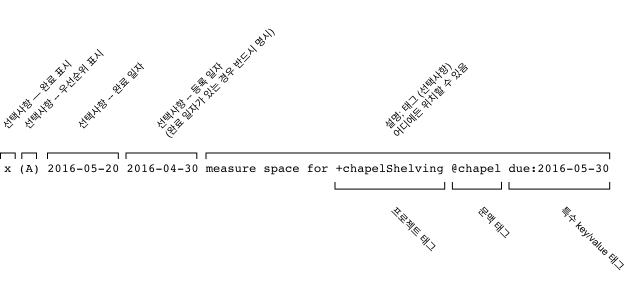

# todo.txt 형식
[](https://gitter.im/todotxt/todotxt)

todo.txt의 이유와 방법에 대한 완벽한 입문서입니다.

todo.txt의 첫 번째이자 가장 중요한 규칙:

> todo.txt 텍스트 파일의 한 줄은 하나의 작업을 나타냅니다.


## 왜 일반 텍스트(plain text)인가?

일반 텍스트(Plain text)는 소프트웨어와 운영 체제에 구애받지 않습니다. 검색 가능하고, 호환성이 높고, 가볍고, 쉽게 조작할 수 있습니다. 정해진 형식이 없습니다. 다른 사람의 웹 서버가 다운되거나 Outlook .PST 파일이 손상되었을 때도 작동합니다. 내보내기 및 가져오기, 데이터베이스, 태그, 플래그, 별표, 우선순위 지정 또는 _여기에 회사 이름 삽입_-같은 규칙도 없습니다.


## 효과적인 todo list의 3가지 축

todo.txt에 있는 특별한 표기법을 사용하면 할 일 목록을 세 가지 핵심 축으로 나눌 수 있습니다.


### 우선순위
할 일 목록은 프로젝트별, 컨텍스트별 혹은 전체적으로 다음에 해야 할 가장 중요한 일이 무엇인지 알려줄 수 있어야 합니다. 선택적으로 작업에 우선순위를 할당하여 목록의 맨 위로 올릴 수 있습니다.


### 프로젝트
큰 프로젝트를 진행하는 유일한 방법은 그와 관련된 작은 하위 작업을 처리하는 것입니다. 당신의 `todo.txt`는 프로젝트와 관련된 모든 작업을 나열할 수 있어야 합니다.

"차고 청소"같은 프로젝트를 진행하려면 내 작업 목록에서 해당 프로젝트를 진행하기 위해 취해야 할 다음 논리적 행동을 알려주어야 합니다. "차고 청소"는 좋은 할 일 항목이 아닙니다. 그러나 "차고 청소" 프로젝트의 "Goodwill에 전화하여 픽업 예약"은 좋은 항목입니다.


### 컨텍스트
[Getting Things Done](https://en.wikipedia.org/wiki/Getting_Things_Done)의 저자 David Allen은 컨텍스트, 즉 작업을 수행할 장소와 상황에 따라 작업 목록을 나눌 것을 제안합니다. 보내야 할 메시지는 `@email` 컨텍스트로, 걸어야 할 전화는 `@phone`으로, 집안일 프로젝트는 `@home`으로 이동합니다.

이렇게 하면 차 안에서 휴대폰으로 몇 분의 여유가 있을 때 `@phone` 작업을 쉽게 확인하고 기회가 있을 때 한두 통의 전화를 걸 수 있습니다.

이 모든 것이 `todo.txt` 내에서 가능합니다.


## `todo.txt` 형식 규칙



`todo.txt`는 일반 텍스트 파일입니다. 우선순위, 프로젝트, 컨텍스트, 생성 및 완료 날짜와 같은 구조화된 작업 메타데이터를 활용하려면 몇 가지 간단하지만 유연한 파일 형식 규칙이 있습니다.

철학적으로 `todo.txt` 파일 형식에는 두 가지 목표가 있습니다.

- 파일 내용은 일반 텍스트 뷰어나 편집기 이외의 도구 없이도 사람이 읽을 수 있어야 합니다.
- 사용자는 일반 텍스트 편집기에서 합리적이고 예상되는 방식으로 파일 내용을 조작할 수 있습니다. 예를 들어, 알파벳순으로 줄을 정렬할 수 있는 텍스트 편집기는 의미 있는 방식으로 작업 목록을 정렬할 수 있어야 합니다.

이 두 가지 목표 때문에 예를 들어 줄은 우선순위 및/또는 날짜로 시작하여 우선순위나 시간순으로 쉽게 정렬할 수 있으며, 완료된 항목은 `x`로 표시하여 알파벳순 목록의 맨 아래에 정렬되고 채워진 확인란처럼 보입니다.

나머지는 다음과 같습니다.


## 미완료 작업: 3가지 형식 규칙

todo.txt의 장점은 완전히 비정형적이라는 것입니다. 각 작업에 첨부할 수 있는 필드는 상상력에 의해서만 제한됩니다. 시작하려면 특수 표기법을 사용하여 작업 컨텍스트(예: `@phone` ), 프로젝트(예: `+GarageSale` ) 및 우선순위(예: `(A)` )를 나타냅니다.

todo.txt 파일은 다음과 같을 수 있습니다.

```
(A) Thank Mom for the meatballs @phone
(B) Schedule Goodwill pickup +GarageSale @phone
Post signs around the neighborhood +GarageSale
@GroceryStore pies
```

`@phone` 컨텍스트 항목에 대한 검색 및 필터링 결과는 다음과 같습니다.

```
(A) Thank Mom for the meatballs @phone
(B) Schedule Goodwill pickup +GarageSale @phone
```

`+GarageSale` 프로젝트 항목만 보려면 다음과 같이 출력됩니다.

```
(B) Schedule Goodwill pickup +GarageSale @phone
Post signs around the neighborhood +GarageSale
```

현재 할 일에 대한 세 가지 형식 규칙이 있습니다.

### 규칙 1: 우선순위가 있는 경우 항상 맨 앞에 표시됩니다.

우선순위는 괄호로 묶고 공백을 뒤에 붙인 A-Z 대문자입니다.

이 작업에는 우선순위가 있습니다.

```
(A) Call Mom
```

이러한 작업에는 우선순위가 없습니다.

```
Really gotta call Mom (A) @phone @someday
(b) Get back to the boss
(B)->Submit TPS report
```


### 규칙 2: 작업 생성 날짜는 선택적으로 우선순위와 공백 바로 뒤에 표시될 수 있습니다.

우선순위가 없으면 생성 날짜가 먼저 표시됩니다. 생성 날짜가 있는 경우 `YYYY-MM-DD` 형식이어야 합니다.

이러한 작업에는 생성 날짜가 있습니다.

```
2011-03-02 Document +TodoTxt task format
(A) 2011-03-02 Call Mom
```

이 작업에는 생성 날짜가 없습니다.

```
(A) Call Mom 2011-03-02
```


### 규칙 3: 컨텍스트와 프로젝트는 우선순위/앞에 붙는 날짜 _뒤_ 줄의 아무 곳에나 나타날 수 있습니다.

- *컨텍스트* 앞에는 단일 공백과 앳-기호 (`@`)가 옵니다.
- *프로젝트* 앞에는 단일 공백과 플러스-기호 (`+`)가 옵니다.
- *프로젝트* 또는 *컨텍스트*에는 공백이 아닌 모든 문자가 포함됩니다.
- *작업*에는 0개, 1개 또는 그 이상의 *프로젝트*와 *컨텍스트*가 포함될 수 있습니다.

예를 들어, 이 작업은 `+Family` 및 `+PeaceLoveAndHappiness` 프로젝트의 일부이며 `@iphone` 및 `@phone` 컨텍스트의 일부이기도 합니다.

```
(A) Call Mom +Family +PeaceLoveAndHappiness @iphone @phone
```

이 작업에는 컨텍스트가 없습니다.

```
Email SoAndSo at soandso@example.com
```

이 작업에는 프로젝트가 없습니다.

```
Learn how to add 2+2
```


## 완료된 작업: 2가지 형식 규칙

작업이 완료되었음을 나타내는 두 가지가 있습니다.


### 규칙 1: 완료된 작업은 소문자 x 문자 (`x`)로 시작합니다.

`x`(대소문자 구분 및 소문자)로 시작하고 바로 뒤에 공백이 오는 작업은 완료된 것으로 표시됩니다.

이것은 완료된 작업입니다.

```
x 2011-03-03 Call Mom
```

이것들은 완료된 작업이 아닙니다.

```
xylophone lesson
X 2012-01-01 Make resolutions
(A) x Find ticket prices
```

완료된 작업이 표준 정렬 도구를 사용하여 작업 목록의 맨 아래로 정렬되도록 소문자 x를 사용합니다.


### 규칙 2: 완료 날짜는 x 바로 뒤에 공백으로 구분하여 표시됩니다.

예를 들어:

```
x 2011-03-02 2011-03-01 Review Tim's pull request +TodoTxtTouch @github
```

작업에 생성 날짜를 앞에 추가한 경우 완료 시 완료 날짜 바로 뒤에 표시됩니다. 이렇게 하면 완료된 작업이 표준 정렬 도구를 사용하여 날짜순으로 정렬됩니다. 많은 Todo.txt 클라이언트는 작업 완료 시 우선순위를 버립니다. 이를 보존하려면 아래에 설명된 `key:value` 형식(예: `pri:A`)을 사용하십시오.

완료 날짜(필수)와 함께 앞에 붙는 날짜(선택 사항)를 사용한 경우 작업을 완료하는 데 걸린 일수를 계산할 수 있습니다.


## 추가 파일 형식 정의

도구 개발자는 추가 메타데이터에 대한 추가 형식 규칙을 정의할 수 있습니다.

개발자는 `key:value` 형식을 사용하여 추가 메타데이터(예: 마감일로 `due:2010-01-02`)를 정의해야 합니다.

`key`와 `value`는 모두 콜론이 아닌 공백이 아닌 문자로 구성되어야 합니다. 콜론 하나만 `key`와 `value`를 구분합니다.
