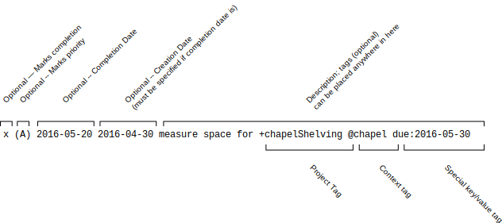

# todo.txt format
[](https://gitter.im/todotxt/todotxt)

A complete primer on the whys and hows of todo.txt.

The first and most important rule of todo.txt:

> A single line in your todo.txt text file represents a single task.


## Why plain text?

Plain text is software and operating system agnostic. It's searchable, portable, lightweight, and easily manipulated. It's unstructured. It works when someone else's web server is down or your Outlook .PST file is corrupt. There's no exporting and importing, no databases or tags or flags or stars or prioritizing or _insert company name here_-induced rules on what you can and can't do with it.


## The 3 axes of an effective todo list

Using special notation in todo.txt, you can create a list that's sliceable by 3 key axes.


### Priority
Your todo list should be able to tell you what's the next most important thing for you to get done - either by project or by context or overall. You can optionally assign tasks a priority that'll bubble them up to the top of the list.


### Project
The only way to move a big project forward is to tackle a small subtask associated with it. Your `todo.txt` should be able to list out all the tasks specific to a project.

In order to move along a project like "Cleaning out the garage," my task list should give me the next logical action to take in order to move that project along. "Clean out the garage" isn't a good todo item; but "Call Goodwill to schedule pickup" in the "Clean out garage" project is.


### Context
[Getting Things Done](https://en.wikipedia.org/wiki/Getting_Things_Done) author David Allen suggests splitting up your task lists by context - ie, the place and situation where you'll work on the job. Messages that you need to send go in the `@email` context; calls to be made `@phone`, household projects `@home`.

That way, when you've got a few minutes in the car with your cell phone, you can easily check your `@phone` tasks and make a call or two while you have the opportunity.

This is all possible inside `todo.txt`.


## `todo.txt` format rules



Your `todo.txt` is a plain text file. To take advantage of structured task metadata like priority, projects, context, creation, and completion date, there are a few simple but flexible file format rules.

Philosophically, the `todo.txt` file format has two goals:

- The file contents should be human-readable without requiring any tools other than a plain text viewer or editor.
- A user can manipulate the file contents in a plain text editor in sensible, expected ways. For example, a text editor that can sort lines alphabetically should be able to sort your task list in a meaningful way.

These two goals are why, for example, lines start with priority and/or dates, so that they are easily sorted by priority or time, and completed items are marked with an `x`, which both sorts at the bottom of an alphabetical list and looks like a filled-in checkbox.

Here are the rest.


## Incomplete Tasks: 3 Format Rules

The beauty of todo.txt is that it's completely unstructured; the fields you can attach to each task are only limited by your imagination. To get started, use special notation to indicate task context (e.g. `@phone` ), project (e.g. `+GarageSale` ) and priority (e.g. `(A)` ).

A todo.txt file might look like the following:

```
(A) Thank Mom for the meatballs @phone
(B) Schedule Goodwill pickup +GarageSale @phone
Post signs around the neighborhood +GarageSale
@GroceryStore Eskimo pies
```

A search and filter for the `@phone` contextual items would output:

```
(A) Thank Mom for the meatballs @phone
(B) Schedule Goodwill pickup +GarageSale @phone
```

To just see the `+GarageSale` project items would output:

```
(B) Schedule Goodwill pickup +GarageSale @phone
Post signs around the neighborhood +GarageSale
```

There are three formatting rules for current todo's.

### Rule 1: If priority exists, it ALWAYS appears first.

The priority is an uppercase character from A-Z enclosed in parentheses and followed by a space.

This task has a priority:

```
(A) Call Mom
```

These tasks do not have any priorities:

```
Really gotta call Mom (A) @phone @someday
(b) Get back to the boss
(B)->Submit TPS report
```


### Rule 2: A task's creation date may optionally appear directly after priority and a space.

If there is no priority, the creation date appears first. If the creation date exists, it should be in the format `YYYY-MM-DD`.

These tasks have creation dates:

```
2011-03-02 Document +TodoTxt task format
(A) 2011-03-02 Call Mom
```

This task doesn't have a creation date:

```
(A) Call Mom 2011-03-02
```


### Rule 3: Contexts and Projects may appear anywhere in the line _after_ priority/prepended date.

- A *context* is preceded by a single space and an at-sign (`@`).
- A *project* is preceded by a single space and a plus-sign (`+`).
- A *project* or *context* contains any non-whitespace character.
- A *task* may have zero, one, or more than one *projects* and *contexts* included in it.

For example, this task is part of the `+Family` and `+PeaceLoveAndHappiness` projects as well as the `@iphone` and `@phone` contexts:

```
(A) Call Mom +Family +PeaceLoveAndHappiness @iphone @phone
```

This task has no contexts in it:

```
Email SoAndSo at soandso@example.com
```

This task has no projects in it:

```
Learn how to add 2+2
```


## Complete Tasks: 2 Format Rules

Two things indicate that a task has been completed.


### Rule 1: A completed task starts with an lowercase x character (`x`).

If a task starts with an `x` (case-sensitive and lowercase) followed directly by a space, it is marked as complete.

This is a complete task:

```
x 2011-03-03 Call Mom
```

These are not complete tasks.

```
xylophone lesson
X 2012-01-01 Make resolutions
(A) x Find ticket prices
```

We use a lowercase x so that completed tasks sort to the bottom of the task list using standard sort tools.


### Rule 2: The date of completion appears directly after the x, separated by a space.

For example:

```
x 2011-03-02 2011-03-01 Review Tim's pull request +TodoTxtTouch @github
```

If you’ve prepended the creation date to your task, on completion it will appear directly after the completion date. This is so your completed tasks sort by date using standard sort tools. Many Todo.txt clients discard priority on task completion. To preserve it, use the `key:value` format described below (e.g. `pri:A`)

With the completed date (required), if you've used the prepended date (optional), you can calculate how many days it took to complete a task.


## Additional File Format Definitions

Tool developers may define additional formatting rules for extra metadata.

Developers should use the format `key:value` to define additional metadata (e.g. `due:2010-01-02` as a due date).

Both `key` and `value` must consist of non-whitespace characters, which are not colons. Only one colon separates the `key` and `value`.

